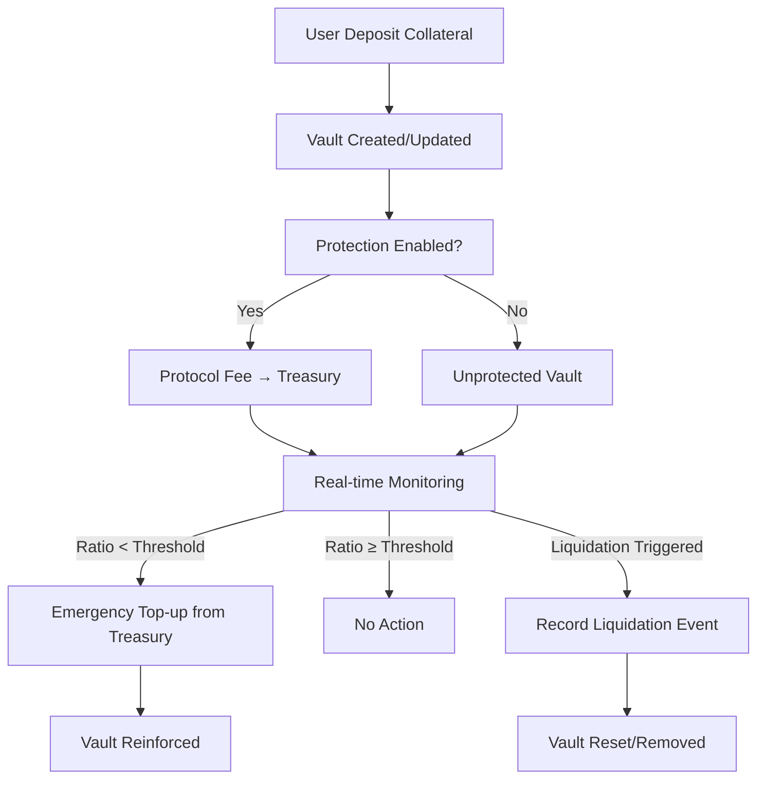

# LiquidShield Protocol

### Autonomous Collateral Protection System for Bitcoin-Backed Lending Positions on Stacks

---

## 📖 Overview

LiquidShield is a **sophisticated DeFi risk-management protocol** designed to safeguard Bitcoin-backed lending positions against liquidation. Built on the **Stacks blockchain** and anchored to Bitcoin security, it provides **institutional-grade collateral reinforcement** mechanisms, predictive monitoring, and community-governed treasury management.

By autonomously protecting collateralized vaults, LiquidShield prevents **liquidation cascades**, ensures **capital efficiency**, and establishes a robust foundation for DeFi protocols, institutional traders, and lending platforms on Bitcoin Layer 2.

---

## ✨ Key Features

* **Autonomous Vault Protection** – Continuous monitoring and reinforcement of at-risk positions.
* **Configurable Protection Parameters** – Users customize auto-top-up, thresholds, and emergency delegates.
* **Community-Governed Treasury** – Treasury reserves are used for reinforcement and emergency intervention.
* **Real-Time Risk Monitoring** – Predictive analytics with configurable alert thresholds.
* **Multi-Layer Safeguards** – From vault-level controls to protocol-wide pause/resume authority.
* **Comprehensive Event Tracking** – On-chain history of liquidations, treasury usage, and protection activity.

---

## 🏛 System Overview

LiquidShield introduces a **protective layer** around lending protocols:

1. **Users deposit collateral** into personal vaults.
2. **Vaults track debt and collateral ratios** in real time.
3. If the collateral ratio falls below a configured **alert threshold**:

   * The system may **auto-top-up** from the treasury (if enabled).
   * Emergency delegates can be notified to intervene.
4. If liquidation occurs, the protocol **records event data** (collateral seized, debt repaid, vault state).
5. A **community treasury** grows through protocol fees and is used for reinforcement or emergency interventions.

---

## 🔹 Contract Architecture

The contract is organized into **five major modules**:

### 1. **Governance & Protocol Control**

* `CONTRACT-OWNER` authority for admin functions.
* `toggle-protocol-state` to pause/resume global operations.
* `withdraw-from-treasury` for treasury fund management.

### 2. **Vault Management**

* `deposit-collateral` / `withdraw-collateral` – Manage collateral balances.
* `update-vault-debt` – Oracle-driven updates for outstanding loan amounts.
* `get-vault-info` / `get-collateral-ratio` – Real-time visibility on vault state.

### 3. **Protection Layer**

* `enable-protection` / `disable-protection` – Opt-in vault protection.
* `configure-protection` – User-defined thresholds, delegates, and auto-top-up parameters.
* `emergency-top-up` – Treasury-funded reinforcement for at-risk vaults.

### 4. **Liquidation Management**

* `record-liquidation` – Records liquidation events with metadata (protected/unprotected).
* `get-liquidation-event` – Query liquidation history by event ID.

### 5. **Treasury & Fees**

* Treasury grows via **protection fees**.
* Funds are allocated for **emergency reinforcements** and **community-governed interventions**.

---

## 📊 Data Structures

### Vaults

Tracks collateral and debt per user.

```clarity
{
  collateral-amount: uint,
  debt-amount: uint,
  protection-enabled: bool,
  last-update-height: uint,
  total-fees-paid: uint
}
```

### Protection Settings

User-specific reinforcement rules.

```clarity
{
  auto-top-up-enabled: bool,
  emergency-contact: (optional principal),
  max-top-up-amount: uint,
  alert-threshold: uint
}
```

### Liquidation Events

Immutable history of liquidation activity.

```clarity
{
  vault-owner: principal,
  debt-repaid: uint,
  collateral-seized: uint,
  event-height: uint,
  was-protected: bool
}
```

---

## 🔄 Data Flow (Simplified)



---

## ⚙️ Protection Lifecycle

1. **Initialization** – User deposits collateral and optionally enables protection.
2. **Configuration** – User sets thresholds, auto-top-up, and emergency delegates.
3. **Monitoring** – Protocol continuously calculates collateral ratios.
4. **Reinforcement** – If a vault falls below its alert threshold, treasury intervention is triggered.
5. **Liquidation Event** – If still liquidated, the event is logged with metadata for transparency.

---

## 🔐 Security Considerations

* **Strict Authorization** – Only `CONTRACT-OWNER` can update debt, record liquidations, or manage treasury.
* **Protocol Pausing** – Global circuit breaker to halt operations in emergencies.
* **Collateral Safety Checks** – Withdrawals blocked if ratios fall below safe thresholds.
* **Treasury Protection** – Reinforcements limited by user-defined caps and available funds.

---

## 🚀 Use Cases

* **DeFi Lending Platforms** – Protect borrower positions against sudden liquidation.
* **Institutional Traders** – Reduce counterparty risk with automated safeguards.
* **DAO Treasury Management** – Deploy capital into risk-mitigating reinforcement pools.

---

## 📌 Next Steps

Future upgrades may include:

* Multi-asset collateral support (BTC, sBTC, STX, stablecoins).
* Cross-protocol integrations with **BitVault** and **FlexiVault**.
* Reputation-based treasury access and governance.
* On-chain predictive analytics for liquidation forecasting.
